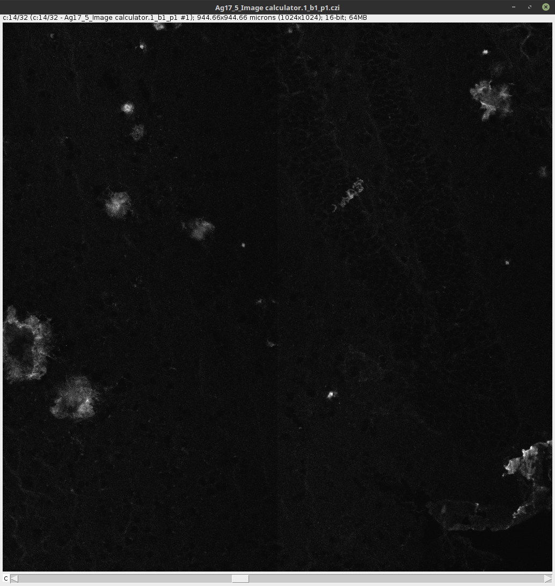

# Lambda Stack Kymograph

Plugin coded to allow analysis of lambda stack in ImageJ.

## Usage

In order to use it, first open the lambda stack using BioFormats. 

/!\ This plugin has been tested with CZI files containing metadata with the emission wavelengths.

Then start the plugin. A MIP image will be presented and asking you to do a line selection corresponding to the region of interest.

 

<!-- -->

<!-- --> 

Once done, click OK and you will get the kymograph corresponding to the ROI selected.

<!--  --> 

The X axis will correspond to the wavelengths found in the metadata. The plugin will also save:

* A CSV with the pixel intensities corresponding to the ROI
* A CSV with normalized pixel intensities corresponding to the ROI

